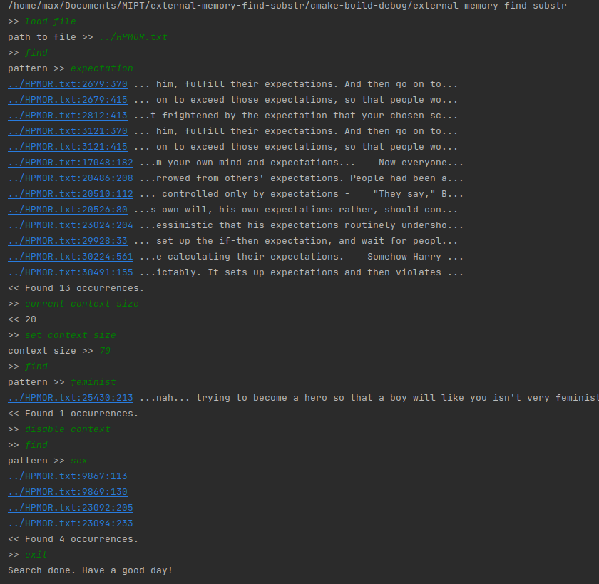

# external-memory-find-substr

Basically `grep` but no bloat. Используется для поиска подстроки в большом файле.

# Постановка задачи

Пусть есть большой текстовый файл (например, логи), который не помещается в RAM, и несколько запросов
к нему: найти все вхождения некоторой подстроки. Предполагается, что каждая подстрока-паттерн короткая,
и запросы поступают онлайн. Строить по файлу индексы и сохранять их на диске в предпосчете невыгодно, т.к.
файл слишком большой, и быстрее дать несколько ответов сразу (или вообще файл изменяется, и на каждый
запрос нужно дать информацию по наиболее актуальным логам).

# Описание алгоритма

Обычный КМП за `O(|pattern|)` по памяти и `O(|pattern| + |text|)` по времени на запрос.

Программа считает префикс-функцию, как если бы она вычислялась для строки `pattern#text`,
но при этом в каждый момент времени хранится только префикс-функция паттерна и `O(1)` доп. информации.
Этого достаточно потому что длина никакого супрефикса не превосходит длины паттерна. Сам текст никогда
полностью не подгружается в память, а читается из файла короткими кусками.

# Build

```
$ mkdir build
$ cd build
$ cmake ..
$ make
$ 
$ ./external_memory_find_substr
```

# Использование

Можно почитать справку, которую выдает консольный клиент по `help`.

```
usage:
    current file -- show currently loaded file path
    load file -- switch to another file
    find -- find pattern in currently loaded file
    current context size -- get current context size
    set context size -- use another context size
    enable context -- show context of occurrences
    disable context -- do not
```

Пример: поиск по тексту ["Harry Potter and Methods of Rationality"](resources/HPMOR.txt).


